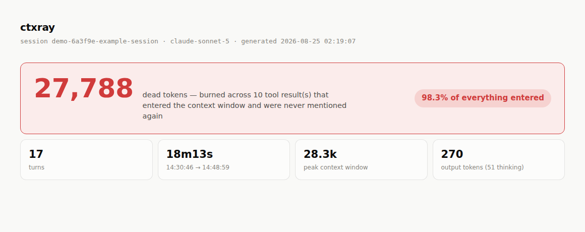
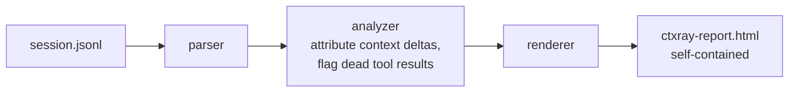

# ctxray

**Flamegraph for your agent's context window.**

[](https://github.com/Gabriel-Gerhardt/ctxray/actions/workflows/ci.yml)
[](https://golangci-lint.run/)
[](go.mod)
[](LICENSE)

Point it at a Claude Code session transcript. Get back one HTML file that shows, turn by turn, where every token in the context window came from — and how much of it was never mentioned again.

<picture>
  <source media="(prefers-color-scheme: dark)" srcset="docs/hero-dark.png">
  
</picture>

```
$ ctxray my-session.jsonl
ctxray: 17 turns · 28.3k tokens entered · peak window 28.3k
ctxray: 98.3% dead context — 27.8k tokens across 10 tool result(s) never referenced again
ctxray: report written to ctxray-report.html
```

I kept burning six-figure token budgets on a session and having no idea afterward what any of it actually bought me. Every agent CLI tells you *how many* tokens you spent; none of them will tell you *on what*. So `ctxray` reconstructs it from the transcript you already have on disk — no telemetry, no API key, no dashboard to sign up for.

## Quickstart

```bash
git clone https://github.com/Gabriel-Gerhardt/ctxray
cd ctxray
go build -o ctxray .
./ctxray testdata/sample.jsonl -open
```

That last command runs against the synthetic demo transcript checked into the repo (no real conversation content) so you can see a report before hunting down a real session file. Once you've got one:

```bash
./ctxray ~/.claude/projects/*/*.jsonl -open
```

Or, once a release is tagged: `go install github.com/Gabriel-Gerhardt/ctxray@latest`

```
Usage: ctxray [flags] <session.jsonl>

  -o string   output HTML file (default "ctxray-report.html")
  -open       open the report in the default browser when done
```

## How it works

Claude Code writes one JSON object per line to `~/.claude/projects/<project>/<session>.jsonl` as a session runs — every message, every tool call, every tool result, and the exact token usage Anthropic billed for each assistant turn (input, output, cache-write, cache-read).

`ctxray` reads that file once and reconstructs, turn by turn:

1. **What entered the context window.** The delta between two consecutive turns' billed context size is attributed to whatever landed in the conversation since the last turn — a tool result, a stretch of user text, or (on turn one, always) the system prompt and tool schemas.
2. **What the assistant produced in exchange.** Output tokens split across the reply text, extended thinking, and any tool calls.
3. **What never got used again.** Every tool result over a size threshold is checked against every assistant turn from that point on — its own reply included. If none of its distinctive content shows up anywhere later, it's flagged dead.

The report leads with a plain sorted list — the five biggest dead blocks, no chart-reading required — then the flamegraph underneath for the turn-by-turn detail: one row per turn that actually added tokens, bar length proportional to how much, hatched wherever a block was flagged dead. No server, no build step, no JavaScript — inline CSS and a couple of embedded SVGs, so it opens the same from `file://` as it does hosted anywhere.

<picture>
  <source media="(prefers-color-scheme: dark)" srcset="docs/screenshot-dark.png">
  
</picture>

Color is intentionally sparse — five fixed identities (user, Bash, Read, Grep, everything else) instead of a new hue per tool, so a session with twenty different MCP tools still reads as a handful of colors, not a rainbow. Anything not called out by name folds into "other" and gets named in the legend anyway.

## Ceiling

Token counts under roughly 1,000 are *estimated* from character length (~4 chars/token) and scaled to match what Anthropic actually billed for that turn — that keeps the totals correct, but the per-block split within a turn is attribution, not an exact tokenizer count.

"Dead" is a heuristic, not a proof: a block is flagged when none of its distinctive words show up in the assistant's reply that turn or any later one. A tool result can matter without being quoted back (a `Read` that just confirms a hunch, a `Grep` with zero matches that rules something out) — those show up hatched too. Treat the dead-token percentage as a lead worth checking on a specific turn, not a verdict on the whole session.

There's no table view of the flamegraph yet — exact per-block numbers live in the hover tooltip, not on the page. And tooltips are hover-only; keyboard focus doesn't currently surface the same text.

## Diagram



## Use Cases

- You ran an agent, it burned 180k tokens, and you have no idea where they went.
- A huge `npm test` / `grep` / directory listing landed in context early and you want to know if anything downstream ever actually used it.
- You're deciding whether a tool's output format (verbose logs vs. a summary) is worth the tokens it costs every time it's called.
- You want a number to back up "my session was mostly dead weight" instead of a feeling.

## Tech Stack

- **Go** (standard library only — zero dependencies, `go.mod` has no `require` block)
- `encoding/json` for the transcript parser, `html/template` + `embed` for the report
- Zero JavaScript in the output — the flamegraph is CSS flexbox, the timeline is inline SVG
- Colors are a validated categorical palette, not eyeballed — fixed hue order, checked for colorblind-safe separation before anything shipped

## Contact
- LinkedIn: https://www.linkedin.com/in/gabriel-gerhardt27/
- Email: gabrielgerhardt27@gmail.com
- GitHub: https://github.com/Gabriel-Gerhardt
