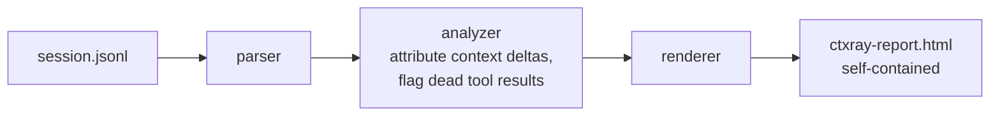

# ctxray

Flamegraph for your agent's context window. Point it at a Claude Code session transcript, get back a single HTML file that shows, turn by turn, where every token in the context window came from — and how much of it was never mentioned again.

```
ctxray: 5 turns · 12.1k tokens entered · peak window 12.1k
ctxray: 8.0% dead context — 971 tokens across 2 tool result(s) never referenced again
ctxray: report written to ctxray-report.html
```


## How It Works

Claude Code writes one JSON object per line to `~/.claude/projects/<project>/<session>.jsonl` as a session runs — every message, every tool call, every tool result, and the exact token usage Anthropic billed for each assistant turn (input, output, cache-write, cache-read).

`ctxray` reads that file once and reconstructs, turn by turn:

1. **What entered the context window.** The delta between two consecutive turns' billed context size is attributed to whatever landed in the conversation since the last turn — a tool result, a stretch of user text, or (on turn one, always) the system prompt and tool schemas.
2. **What the assistant produced in exchange.** Output tokens split across the reply text, extended thinking, and any tool calls.
3. **What never got used again.** Every tool result over a size threshold is checked against every assistant turn from that point on — its own reply included. If none of its distinctive content shows up anywhere later, it's flagged dead.

The result renders as a flamegraph-style HTML report: one row per turn, one segment per content source, hatched wherever a block was flagged dead. No server, no build step, no JavaScript — it's inline CSS and a couple of embedded SVGs, so it opens the same from `file://` as it does hosted anywhere.

## Ceiling

Token counts under roughly 1,000 tokens are *estimated* from character length (~4 chars/token) and then scaled to match what Anthropic actually billed for that turn — that makes the totals correct, but the per-block split within a turn is attribution, not an exact tokenizer count.

"Dead" is a heuristic, not a proof: a block is flagged when none of its distinctive words show up in any later assistant turn. A tool result can matter without being quoted back (a `Read` that just confirms a hunch, a `Grep` with zero matches that rules something out) — those will show up hatched too. Treat the dead-token percentage as a lead worth investigating on a specific turn, not a verdict on the session.

## Tech Stack

- **Go** (standard library only — no dependencies)
- `encoding/json` for the transcript parser
- `html/template` + `embed` for the report — the whole binary is self-contained, and so is everything it produces
- Zero JavaScript in the output; the "flamegraph" is CSS flexbox, the timeline is inline SVG

## Diagram



## Use Cases

- You ran an agent, it burned 180k tokens, and you have no idea where they went.
- A huge `npm test` / `grep` / directory listing landed in context early and you want to know if anything downstream ever actually used it.
- You're deciding whether a tool's output format (verbose logs vs. a summary) is worth the tokens it costs every time it's called.
- You want a number to back up "my session was mostly dead weight" instead of a feeling.

## Set-up

Requirements: Go 1.24+.

```bash
git clone https://github.com/Gabriel-Gerhardt/ctxray
cd ctxray
go build -o ctxray .
./ctxray ~/.claude/projects/*/*.jsonl -open
```

Or, once a release is tagged:

```bash
go install github.com/Gabriel-Gerhardt/ctxray@latest
```

Usage:

```
ctxray [flags] <session.jsonl>

  -o string   output HTML file (default "ctxray-report.html")
  -open       open the report in the default browser when done
```

`testdata/sample.jsonl` is a small synthetic transcript (no real conversation content) if you want to try it without hunting for a real session file first:

```bash
./ctxray testdata/sample.jsonl -open
```

## Contact
- LinkedIn: https://www.linkedin.com/in/gabriel-gerhardt-0a8b852b9/
- Email: gabrielgerhardt27@gmail.com
- GitHub: https://github.com/Gabriel-Gerhardt
