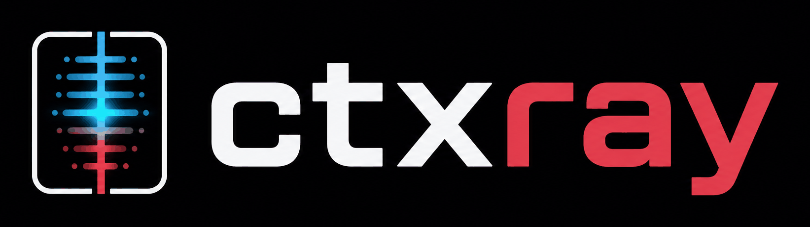
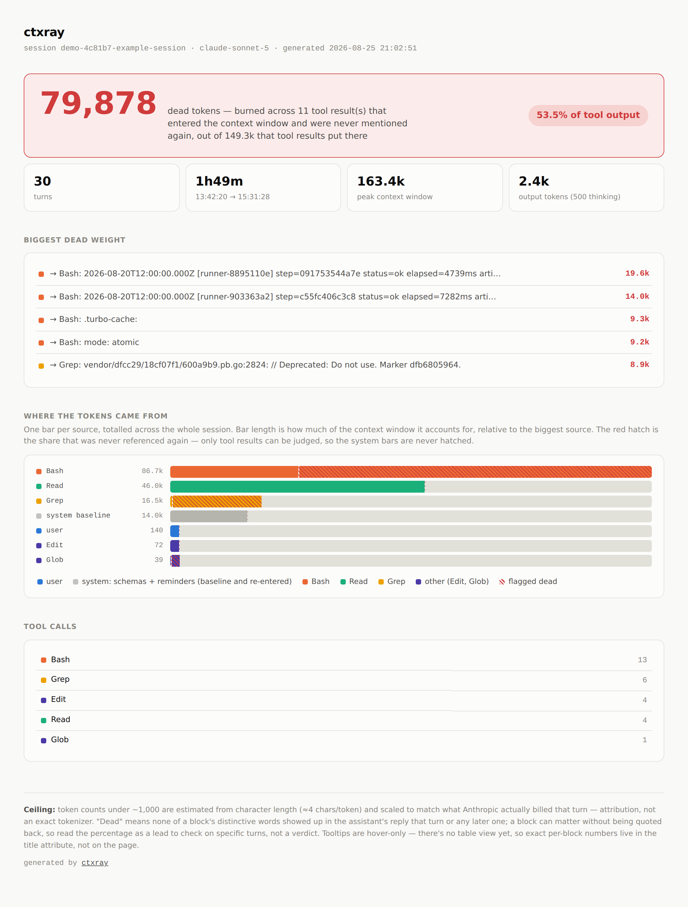

<p align="center">
  
</p>

<p align="center"><strong>Flamegraph for your agent's context window.</strong></p>

<p align="center">
  <a href="https://github.com/Gabriel-Gerhardt/ctxray/actions/workflows/ci.yml"></a>
  <a href="https://golangci-lint.run/"></a>
  <a href="go.mod"></a>
  <a href="LICENSE"></a>
</p>

Your last agent run burned 160k tokens. Which ones actually did anything?

Point `ctxray` at a Claude Code session transcript and it answers that in one self-contained HTML file: where every token in the context window came from, and how much of it was never mentioned again.

<picture>
  <source media="(prefers-color-scheme: dark)" srcset="docs/screenshot-dark.png">
  
</picture>

## About

A long agent session is expensive in a way the totals hide. Nothing ever leaves the context window on its own, and every request re-sends the whole thing — so a 20k-token directory listing that lands on turn 3 isn't paid for once. It's re-sent with every turn after it, billed again each time (at the cheaper cache-read rate, but billed), and it goes on taking up room until the session compacts and starts throwing things away. The bigger cost is usually that: the junk crowds out what the model actually needed.

Every agent CLI tells you *how many* tokens you spent. None of them tell you *on what*. The data to answer it is already sitting on your disk — Claude Code logs every message, tool call and tool result as the session runs, along with the exact usage Anthropic billed for each turn.

`ctxray` reads that file and turns it into a single self-contained HTML report: what entered the context window, which tool put it there, and how much of it never came up again. One Go binary, no telemetry, no API key, no dashboard to sign up for, no dependencies.

## Quickstart

```bash
go install github.com/Gabriel-Gerhardt/ctxray@latest
ctxray ~/.claude/projects/*/*.jsonl -open
```

That's it — one binary, zero dependencies, and the report opens in your browser.

No Go toolchain? Grab a prebuilt binary for your platform from [the latest release](https://github.com/Gabriel-Gerhardt/ctxray/releases/latest).

Want to see a report before hunting down a real session file? The repo ships a synthetic demo transcript (no real conversation content):

```bash
git clone https://github.com/Gabriel-Gerhardt/ctxray && cd ctxray
go run . testdata/sample.jsonl -open
```

```
Usage: ctxray [flags] <session.jsonl>

  -o string   output HTML file (default "ctxray-report.html")
  -open       open the report in the default browser when done
```

## How it works

Claude Code writes one JSON object per line to `~/.claude/projects/<project>/<session>.jsonl` as a session runs — every message, every tool call, every tool result, and the exact token usage Anthropic billed for each assistant turn.

`ctxray` reads that file once and reconstructs three things:

1. **What entered the context window.** The delta between two consecutive turns' billed context size is attributed to whatever landed in the conversation since the last turn — a tool result, a stretch of user text, or, on turn one, the system prompt and tool schemas.
2. **What the assistant produced in exchange.** Output tokens split across the reply text, extended thinking, and any tool calls.
3. **What never got used again.** Every tool result over a size threshold is checked against every assistant turn from that point on, its own reply included. If none of its distinctive content shows up anywhere later, it's flagged dead.

The report opens on the total dead-token count, lists the five biggest dead blocks, then draws one bar per source — Bash, Read, Grep, your own messages, the system prompt — showing what each put into the window across the whole session, with the never-referenced share hatched inside its own bar.

## What the number isn't

"Dead" is a heuristic, not a proof. A block gets flagged when none of its distinctive words show up in the assistant's reply that turn or any later one — so a `Read` that quietly confirmed a hunch, or a `Grep` with zero matches that ruled something out, gets hatched like waste. Treat the percentage as a lead worth chasing, not a verdict.

Per-block counts are estimated from character length (~4 chars/token) and scaled to what Anthropic actually billed that turn. Session totals are exact; the split between blocks inside a turn is attribution.

The percentage is measured against tool output, not against the whole window. The system prompt and tool schemas enter the window as a billing delta with no text attached, so they can never be judged either way — counting them in the denominator would turn the number into a fact about how many tool schemas you have loaded rather than about wasted output.

## Contact

- LinkedIn: https://www.linkedin.com/in/gabriel-gerhardt27/
- Email: gabrielgerhardt27@gmail.com
- GitHub: https://github.com/Gabriel-Gerhardt
